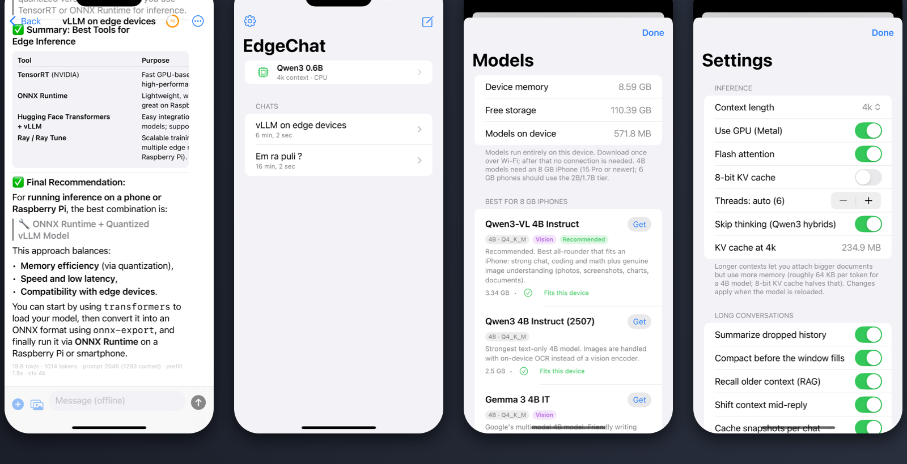
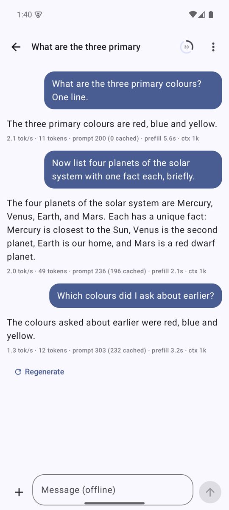
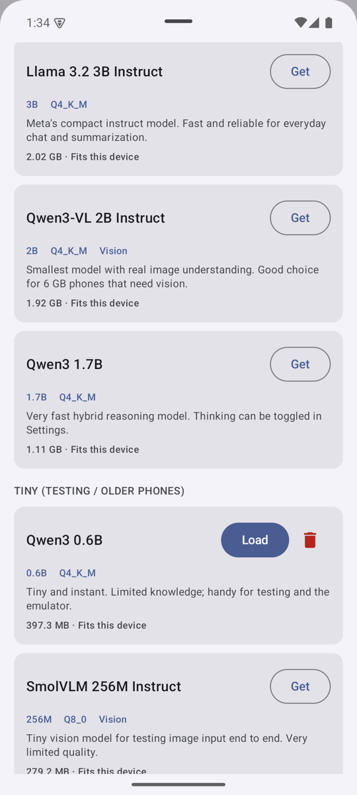

# EdgeChat — offline, on-device AI chat for iPhone

[](https://github.com/RishikeshAluguvelli/EdgeChat/actions/workflows/ci.yml)


[](LICENSE)

A ChatGPT/Claude-style iOS app where **everything runs on the phone**: model inference
(llama.cpp + Metal), document reading (PDFKit), OCR (Vision) and image understanding
(llama.cpp `mtmd` vision encoder). No server, no account, no network: airplane mode works.



<sub>Replies in the chat screen were generated on an iPhone 15 Plus by Qwen3-VL 2B (Q4_K_M); the stats line under each
reply is real. Screens captured in the iOS Simulator.</sub>

## Measured on an iPhone 15 Plus (A16, 6 GB)

Qwen3-VL 2B Instruct, Q4_K_M, 4k context, Metal. Numbers are from the app's own per-turn log across 54 turns of real use.

| | |
|---|---|
| Decode speed | **15–32 tok/s** (median 24) |
| Prompt prefill | **140–570 tok/s** for fresh text; a 768 px photo (≈576 tokens) takes ≈7 s through the vision encoder |
| KV-prefix reuse on follow-up turns | **95–99 %** of the prompt served from cache, so a follow-up costs a few hundred tokens of prefill, not the whole history |
| Photo cost | ≈576 KV cells at 768 px (≈1,000 at 1,024 px); this, not text, is what fills a 4k window |
| Longest single reply | 1,014 tokens without a length cap |

## Highlights

* **Fully offline.** Weights are downloaded once (or imported from Files) and stay on the phone; inference is llama.cpp on Metal.
* **Chat that remembers.** Long conversations survive the context window: KV-prefix reuse, automatic compaction into a
  model-written memory, retrieval of older messages and documents (RAG using the loaded LLM's own embeddings), unlimited
  reply length with *Continue*, and per-chat KV snapshots so switching chats is instant. See [Turn management](#turn-management-and-long-conversations).
* **Documents and photos.** PDFs, text, code, RTF and HTML are read on device (with OCR for scans); photos go to the
  vision encoder of a VLM (Qwen3-VL, Gemma 3) or to OCR + image labels for text-only models.
* **Honest stats.** Every reply shows tokens/s, prompt and cached tokens, context length and why it stopped; a ring in
  the toolbar shows how full the context window is; a diagnostics log can be shared from Settings.
* **Same engine on macOS.** `EdgeChatCore` is a SwiftPM package with a CLI and tests, so the inference path can be
  developed and tested on a Mac before touching the phone.

## Engineering notes: the hard parts

Things that were not obvious and are worth reading the code for.

1. **Context budgets must count KV cells, not RoPE positions.** Qwen3-VL uses M-RoPE: a photo advances the
   position counter by a handful but occupies hundreds of KV cells. Budgeting by positions let the cache overflow
   silently mid-reply; the fix threads a `cells` count through every prompt unit (`LlamaEngine.PromptUnit`) and is
   locked in by `MRopeVisionTests`.
2. **Resume a reply without restarting it.** "Continue" re-sends the partial answer as an *open* assistant turn: the
   chat template is applied with a sentinel appended to the partial text and the formatted prompt is cut at the
   sentinel, so whatever the template would add to close the turn is dropped and the KV prefix still matches
   (35 of 36 prompt tokens cached in the test).
3. **Never let a library abort your process.** `llama_state_seq_load_file` hard-asserts when a stored state does
   not match the current context, which killed the app on every send in an affected chat. Snapshots now use our own
   validated container around the buffer API (`llama_state_seq_get/set_data`), which returns 0 instead. Damaged
   files are rejected and deleted; a test feeds it truncated, padded and garbage files.
4. **Retrieval that small models can survive.** A 2B model re-answers anything you inject. Recall is skipped for
   acknowledgements, capped at four snippets, requires lexical overlap or a clear embedding-spread winner, and is
   labelled "background only" in the prompt.
5. **Compaction before the window fills.** Summarizing when the next message no longer fits delays that message by
   30–60 s on a phone. Summarizing in the background once a reply leaves the window ≥75 % full hides the cost.
6. **Main-thread discipline on iOS.** `llama_backend_init` compiles Metal shaders; doing it on the main thread at
   launch tripped the watchdog and produced a blank app. Backend init is lazy on the engine queue, disk writes are
   serial and off the main thread, and long-chat rendering is memoized (`MarkdownText` block cache, `Equatable` rows).

## Try it

**Android:** a signed release bundle is built from `android/` (see [Android](#android) below); the Play Store listing,
privacy policy and data-safety answers are ready in [docs/play-listing.md](docs/play-listing.md). It goes live on
Google Play once the developer account is set up; until then, build the APK from source or ask for the internal-test link.

**iPhone:** not on the App Store yet (that needs a paid Apple Developer membership and App Review). Follow
[Build & run](#build--run) below, which takes about ten minutes on a Mac with Xcode.

## Which model?

| Model | Size | Vision | Best for |
|---|---|---|---|
| **Qwen3-VL 4B Instruct** (recommended) | 3.1 GB | ✅ | 8 GB iPhones (15 Pro / 16 / 17). Best all-round chat + real image understanding |
| Qwen3 4B Instruct 2507 | 2.3 GB | OCR only | Strongest text-only 4B |
| Gemma 3 4B IT | 3.1 GB | ✅ | Friendlier tone, multilingual |
| Llama 3.2 3B Instruct | 1.9 GB | OCR only | Fast everyday chat on 6 GB phones |
| Qwen3-VL 2B Instruct | 1.8 GB | ✅ | Smallest model with vision |
| Qwen3 1.7B | 1.0 GB | OCR only | Very fast; hybrid thinking toggle |
| Qwen3 0.6B / SmolVLM 256M | <0.4 GB | – / ✅ | Testing and the Simulator |

All are 4-bit GGUFs (Q4_K_M) pulled from Hugging Face; any other GGUF can be imported from
Files (or dropped into the app's folder via Finder). Expect roughly 15–25 tok/s for a 4B
model on an A17 Pro/A18 with Metal.

## Turn management and long conversations

`LlamaEngine.respond` receives the full conversation and:

1. Formats it with the model's own chat template (from the GGUF) and tokenizes it. With a
   vision model, image markers are expanded by `mtmd` into image-token chunks.
2. **Prefix cache** – the prompt is compared unit-by-unit (text tokens, whole images) against
   what sequence 0 of the KV cache already holds; only the new tail is evaluated. A follow-up
   question in a long chat costs a few hundred tokens of prefill, not the whole history, and
   images are never re-encoded across turns.
3. **Context budget** – `min(max_tokens, n_ctx/4)` KV cells are reserved for the reply. Budgets count
   *cells* (tokens), not RoPE positions: Qwen3-VL images take hundreds of cells but only a few
   positions, so counting positions would let the cache overflow silently. If the
   history is too long, the oldest user/assistant pairs are dropped (the system prompt is kept);
   a single oversize turn (a big PDF) is trimmed head+tail.
4. Streams tokens (UTF-8 safe across token boundaries) until EOS, the token limit, or the user
   taps Stop. Stopping is immediate and the cache stays consistent.
5. `<think>…</think>` blocks from hybrid reasoning models are split out and shown collapsed;
   by default thinking is disabled for speed.

On top of that, five mechanisms keep long chats coherent (all on-device, all toggles in Settings):

| Mechanism | Where | What it does |
|---|---|---|
| **Rolling summary** | `EngineController.summarizeIfNeeded` → `LlamaEngine.summarize` | Before a turn that would drop history, the model folds the doomed messages into a running "memory" (≤220 words) appended to the system prompt. The chat shows a *"N earlier messages summarized"* divider; tap it to read the memory. |
| **Unlimited replies + Continue** | `SamplingConfig.maxTokens = 0`, `LlamaEngine.respond(continuing:)` | By default a reply ends when the model stops, not at a token cap. If it reaches the edge of the window, the app summarizes the oldest turns away and resumes the *same* reply (the partial text is re-sent as an open assistant turn, cut at a sentinel before the template's end-of-turn, so the KV prefix is reused). A reply that hits the safety ceiling shows a **Continue** button; typing "continue" does the same. |
| **Auto-compaction** | `EngineController.scheduleCompactionIfNeeded` | When a finished reply leaves the window ≥75% full (or had to shift mid-reply), the same summary runs *right after the reply*, in the background, down to 50% of the window, so the next message is not delayed by a summarization pass. The ring in the chat toolbar shows how full the window was after the last reply; tap it for the numbers. |
| **Retrieval (RAG)** | `MemoryIndex` + `EngineController.recallIfUseful` | Every message and the *full* text of every attached document is chunked (~600 chars) and embedded **with the loaded LLM itself** (mean-pooled hidden states through a temporary embedding context, no extra model). Each new user turn runs a hybrid search (LLM-embedding cosine + BM25) over chunks outside the live window and over trimmed documents; the top hits are injected into that user turn as a `<recalled_context>` block. Injecting into the turn rather than the system prompt keeps the KV prefix cache valid. |
| **Context shift** | `LlamaEngine.shiftContext` | If a reply runs past the reserved space, the oldest half of the non-system tokens is discarded from the KV cache (llama.cpp K-shift) and generation continues; stats show *"context shifted ×N"*. Text-only caches only (M-RoPE image positions are not shifted). |
| **KV snapshots** | `LlamaEngine.saveState/loadState` + `SnapshotStore` | When you switch chats (or the app goes to the background) the sequence state is written to `Caches/KVSnapshots/<model>/<chat>.kv` (plus a unit map so images are tracked). Switching back restores it instead of re-prefilling. The three most recent per model are kept; they are invalidated by model/context changes. The file is our own container (magic, version, `n_ctx`, cell count, payload length) around `llama_state_seq_get_data`, restored with `llama_state_seq_set_data`; llama's `*_load_file` API is avoided on purpose because it *aborts* (no error) when the stored bytes don't match the current context, which crashed the app on every send in an affected chat. A snapshot that fails validation is deleted and the chat is re-prefilled. |

Recall is skipped for acknowledgements ("thanks", "great, good to know") and a snippet must share a query term or
sit clearly at the top of the embedding spread; otherwise small models re-answer whatever was injected. The summary
is written under fixed headings (about the user / topics / decisions / open threads) and scales with the window.

Compaction and the per-turn budget count **KV cells**, not RoPE positions: on Qwen3-VL a photo occupies
hundreds of cells (≈576 at the default 768 px, ≈1000 at 1024 px) even though M-RoPE assigns it only a few
positions, so photos are what fill a 4k window fastest.

The default context length is chosen from device RAM (8k on 8 GB phones, 4k on 6 GB, 2k
below) and Settings shows the exact KV-cache cost of the current choice for the loaded model.

## Documents and images

* **PDF / TXT / MD / code / CSV / JSON / RTF / HTML** → text is extracted on device and wrapped
  in `<document name="…">` tags in the user turn. Scanned PDF pages with no text layer fall back
  to Vision OCR. Over-long documents are trimmed to fit the context (shown as "trimmed to fit").
* **Photos / screenshots / camera** → downscaled (default 768 px ≈ 576 tokens on Qwen3-VL), stored as JPEG, and
  * fed to the vision encoder when the loaded model has an `mmproj` (Qwen3-VL, Gemma 3), or
  * described via on-device OCR + image labels for text-only models.

## Build & run

```bash
brew install xcodegen cmake            # once
scripts/setup-llama.sh --with-simulator # fetch llama.cpp b10988 xcframework (+ build Simulator slice)
cd App && xcodegen generate && open EdgeChat.xcodeproj
```

Set `DEVELOPMENT_TEAM` in `App/project.yml` to your own team (or pick it under *Signing &
Capabilities* in Xcode), plug in an iPhone (iOS 17+), and run. A free Apple ID works for
personal installs (the profile lasts seven days). The `increased-memory-limit` entitlement is
included so 4B models fit on 8 GB phones. Without `--with-simulator` the official xcframework
has no Simulator slice; the device build still works.

Command-line equivalent, once the project is generated:

```bash
xcodebuild -project App/EdgeChat.xcodeproj -scheme EdgeChat -configuration Release \
    -destination "generic/platform=iOS" -allowProvisioningUpdates build
xcrun devicectl device install app --device <your-device-id> \
    .build/DerivedData/Build/Products/Release-iphoneos/EdgeChat.app   # or drag the .app in Xcode → Devices
```

Then open Models, download a model that fits your phone (the catalog marks the recommended one),
and start chatting. Photos and files attach from the composer's `+` button.

## Android

The same app for Android, in `android/`: Kotlin + Jetpack Compose over a C++ port of the engine
(`android/app/src/main/cpp/edgechat_engine.cpp`, a line-for-line port of `LlamaEngine.swift`) built with the NDK
against the same llama.cpp release. Everything above applies: KV-prefix reuse, cell-based budgets, unlimited replies
with resume, background compaction, retrieval, KV snapshots (same on-disk format), photos through `mtmd`, PDFs through
PDFBox with ML Kit OCR for scans. Inference is CPU-only for now (ARM NEON, dotprod and i8mm kernels picked at runtime);
a Vulkan/OpenCL build is on the roadmap.

<p align="center">
  
  
</p>

```bash
scripts/setup-llama-android.sh          # clones llama.cpp b10988 into android/third_party/
cd android && ./gradlew :app:assembleDebug   # needs Android SDK 35, NDK 27, CMake 3.22 (sdkmanager)
adb install app/build/outputs/apk/debug/app-debug.apk
```

Release builds read `android/keystore.properties` (gitignored) for the upload key and produce
`app/build/outputs/bundle/release/app-release.aab` via `./gradlew :app:bundleRelease`. Debug builds accept
`adb shell am start -n com.rishikesh.edgechat.debug/com.rishikesh.edgechat.MainActivity --es autoPrompt 'a ||| b' --ei autoContext 1024`
to script a conversation, like the iOS Simulator flags.

### Test the engine from the terminal (macOS, same code path)

```bash
swift run edgechat-cli --model ~/Models/Qwen3-VL-4B-Instruct-Q4_K_M.gguf \
    --mmproj ~/Models/mmproj-F16.gguf --image photo.jpg --doc report.pdf \
    --prompt "What is in the image?" --prompt "Summarize the document."

EDGECHAT_TEST_MODEL=~/Models/Qwen3-0.6B-Q4_K_M.gguf \
EDGECHAT_TEST_VLM=~/Models/SmolVLM-256M-Instruct-Q8_0.gguf \
EDGECHAT_TEST_MMPROJ=~/Models/mmproj-SmolVLM-256M-Instruct-Q8_0.gguf swift test
```

### Diagnostics

Engine warnings and per-turn stats are appended to `Documents/edgechat.log` on the device
(Settings → About → Share diagnostics log). The stats line under each reply shows tokens/s,
prompt/cached tokens and the context length used.

### Simulator smoke test and screenshots

The Simulator runs on CPU only (no Metal). Copy a small GGUF into the app's Documents folder
and launch with `-EdgeChatAutoPrompt "hello"` to auto-load it and send a message. Separate several
prompts with `|||` and add `-EdgeChatAutoContext 512` to force the summary/recall path:

```bash
xcrun simctl install booted path/to/EdgeChat.app
cp Qwen3-0.6B-Q4_K_M.gguf "$(xcrun simctl get_app_container booted com.rishikesh.edgechat data)/Documents/"
xcrun simctl launch booted com.rishikesh.edgechat -EdgeChatAutoPrompt "hello"
xcrun simctl launch booted com.rishikesh.edgechat -EdgeChatShowScreen models   # list | models | settings
xcrun simctl io booted screenshot models.png
```

## Layout

```
Package.swift                  SwiftPM: EdgeChatCore, edgechat-cli, tests, llama binary target
Sources/EdgeChatCore/          engine, memory index (RAG), attachment processing, catalog
Sources/EdgeChatCLI/           terminal chat for quick experiments
Tests/EdgeChatCoreTests/       engine (cache reuse, truncation, cancel, vision) + unit tests
App/project.yml                xcodegen spec → App/EdgeChat.xcodeproj
App/EdgeChat/                  SwiftUI app
Frameworks/llama.xcframework   prebuilt llama.cpp (gitignored; scripts/setup-llama.sh)
android/                       Android app: Kotlin/Compose UI, C++ engine + JNI (app/src/main/cpp), Gradle
android/third_party/llama.cpp  llama.cpp source for the NDK build (gitignored; scripts/setup-llama-android.sh)
docs/                          screenshots, privacy policy, Play Store listing
```

## Status and roadmap

Working end to end on a physical iPhone; this is a personal project, not a product. Next up, roughly in order:
thinking-mode toggle in the composer for Qwen3 hybrids, streaming Markdown tables, iCloud-free chat export,
and an App Store/TestFlight build once a paid developer membership is in place.

## License

MIT — see [LICENSE](LICENSE). llama.cpp is MIT-licensed; the models in the catalog carry their own licenses
(Apache-2.0 for Qwen3, Gemma Terms of Use for Gemma 3, Llama 3.2 Community License for Llama 3.2).
